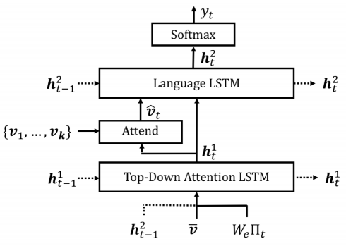
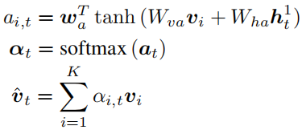
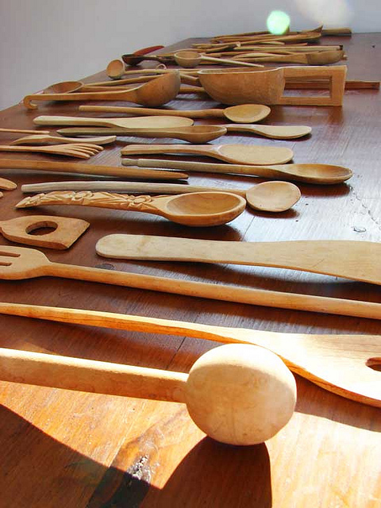

# BUTD_model

 - A pytorch implementation of "[Bottom-Up and Top-Down Attention for Image Captioning and Visual Question Answering](https://openaccess.thecvf.com/content_cvpr_2018/html/Anderson_Bottom-Up_and_Top-Down_CVPR_2018_paper.html)" for image captioning.
 - SCST training from "[Self-critical Sequence Training for Image Captioning](https://openaccess.thecvf.com/content_cvpr_2017/html/Rennie_Self-Critical_Sequence_Training_CVPR_2017_paper.html)".
 - Clear and easy to learn.

## Environment
 - Python 3.7
 - Pytorch 1.3.1

## Method
### 1. Architecture

### 2. Main Process
 - Top-Down Attention LSTM Input  
 
 - Attend  
 
 - Language LSTM Input  
 

## Usage
### 1. Preprocessing
Extract image features by ResNet-101 (denoted as **grid-based features**) and process coco captions data (from [Karpathy splits](https://cs.stanford.edu/people/karpathy/deepimagesent/caption_datasets.zip)) through `preprocess.py`. Need to adjust the parameters, where `resnet101_file` comes from [here](https://drive.google.com/drive/folders/0B7fNdx_jAqhtbVYzOURMdDNHSGM). Image features can also be obtained from [here](https://github.com/peteanderson80/bottom-up-attention) or extracted using [ezeli/bottom_up_features_extract](https://github.com/ezeli/bottom_up_features_extract) repository (using fixed 36 features per image, denoted as **region-based features**).

This project is not limited to the MSCOCO dataset, but you need to process your data according to the data format in the `preprocess.py` file.

### 2. Training
 - First adjust the parameters in `opt.py`:
    - train_mode: 'xe' for pre-training, 'rl' for fine-tuning (+SCST).
    - learning_rate: '4e-4' for xe, '4e-5' for rl.
    - resume: resume training from this checkpoint. required for rl.
    - other parameters can be modified as needed.
 - Run:
    - `python train.py`
    - checkpoint save in `checkpoint` dir, test result save in `result` dir.

### 3. Test
 - `python test.py -t model.pth -i image.jpg`
 - only applicable to the model trained by grid-based features.
 - for region-based features, you can first extract the image feature through [ezeli/bottom_up_features_extract](https://github.com/ezeli/bottom_up_features_extract) repository, and then simply modify the `test.py` file to use.

## Result
### Evaluation metrics
*XE* represents Cross-Entropy loss, and *+SCST* means using reinforcement learning to fine-tune the model (using CIDEr reward).

|features|training|Bleu-1|Bleu-2|Bleu-3|Bleu-4|METEOR|ROUGE_L|CIDEr|SPICE|
|:---:|:---:|:---:|:---:|:---:|:---:|:---:|:---:|:---:|:---:|
|grid-based|XE|75.4|59.1|45.5|34.8|26.9|55.6|109.3|20.2|
|grid-based|+SCST|78.7|62.5|47.6|35.7|27.2|56.7|119.1|20.7|
|region-based|XE|76.0|59.9|46.4|35.8|27.3|56.2|110.9|20.3|
|region-based|+SCST|79.5|63.6|48.8|36.9|27.8|57.6|123.1|21.4|

### Examples

||
|:---:|
|a bunch of wooden knives on a wooden table.|
